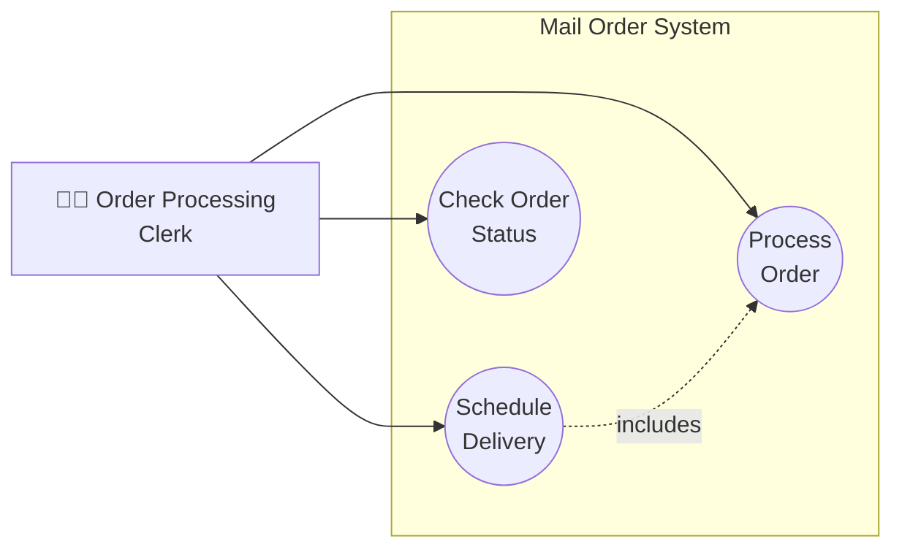

# Use Case Narration Template

## Schedule Delivery

| Field | Description |
|-------|-------------|
| **Use case:** | Schedule Delivery |
| **Actors:** | Order Processing Clerk |
| **Purpose:** | To schedule the delivery of ordered items to a member once all items are available |
| **Overview:** | The Order Processing Clerk verifies that all ordered items are available and held for an order, then schedules a delivery date and assigns the order for shipment to the member's address. |
| **Type:** | **Essential** *(Highlight: -Business Requirement- -System Design- -Extension- **-Essential-** -Other-)* |
| **Preconditions:** | 1. The sales order has been entered into the system by the Customer Service Assistant 2. The member's account is valid and active 3. All ordered items have been checked and held for the order 4. The Order Processing Clerk is logged into the system |
| **Post conditions:** | 1. A delivery date has been assigned to the order 2. The order status is updated to "Scheduled for Delivery" 3. The delivery details are recorded in the system 4. The transaction is logged with the clerk's name |
| **Special Requirements:** | 1. System must have access to current delivery schedules 2. Member's shipping address must be verified 3. System must record the name of the staff member who scheduled the delivery |

---

## Flow of Events

| Actor Action | System Response |
|--------------|-----------------|
| 1. Order Processing Clerk selects a sales order from the pending orders list | 1. System displays order details including member info, items ordered, and item availability status |
| 2. Order Processing Clerk verifies all items show "Held" status | 2. System confirms all items are available and held for this order |
| 3. Order Processing Clerk selects "Schedule Delivery" option | 3. System displays delivery scheduling screen with available delivery dates and time slots |
| 4. Order Processing Clerk selects a delivery date and time slot | 4. System validates the selected date is available for the member's delivery zone |
| 5. Order Processing Clerk confirms the delivery schedule | 5. System assigns the delivery date to the order |
| | 6. System updates order status to "Scheduled for Delivery" |
| | 7. System records the Order Processing Clerk's name and timestamp |
| | 8. System displays confirmation message with delivery details |
| 6. Order Processing Clerk acknowledges confirmation | 9. System returns to pending orders list |

---

## Alternative Flow of Events

| Condition | Actor Action | System Response |
|-----------|--------------|-----------------|
| **A1: Not all items available** | | |
| | 2a. Order Processing Clerk sees one or more items show "Pending" or "Out of Stock" status | 2a. System displays warning that order cannot be scheduled until all items are held |
| | 2b. Order Processing Clerk exits scheduling process | 2b. System returns to pending orders list; order remains in "Processing" status |
| **A2: Invalid delivery address** | | |
| | 4a. Order Processing Clerk selects delivery date | 4a. System detects member's address is incomplete or invalid |
| | | 4b. System displays error message requesting address verification |
| | 4c. Order Processing Clerk notes issue and contacts Customer Service Assistant to update member records | 4c. System logs the address issue; order remains in "Processing" status |
| **A3: No delivery slots available** | | |
| | 4a. Order Processing Clerk views delivery scheduling screen | 4a. System shows no available slots for the next 7 days |
| | 4b. Order Processing Clerk selects a future date beyond 7 days | 4b. System displays available slots for selected date |
| | 4c. Continue from step 5 in main flow | |
| **A4: System error during scheduling** | | |
| | 5a. Order Processing Clerk confirms delivery schedule | 5a. System encounters error and cannot complete scheduling |
| | | 5b. System displays error message and rolls back any partial changes |
| | 5c. Order Processing Clerk retries or reports issue to IT support | 5c. System logs error for technical review |

---

## Use Case Diagram (Mermaid)

---

## Related Use Cases

| Use Case | Relationship |
|----------|--------------|
| Process Order | Precedes Schedule Delivery (items must be held first) |
| Deliver Goods | Follows Schedule Delivery |
| Check Order Status | Can be performed before/after to verify scheduling |
| Find Member Records | May be needed to verify delivery address |
