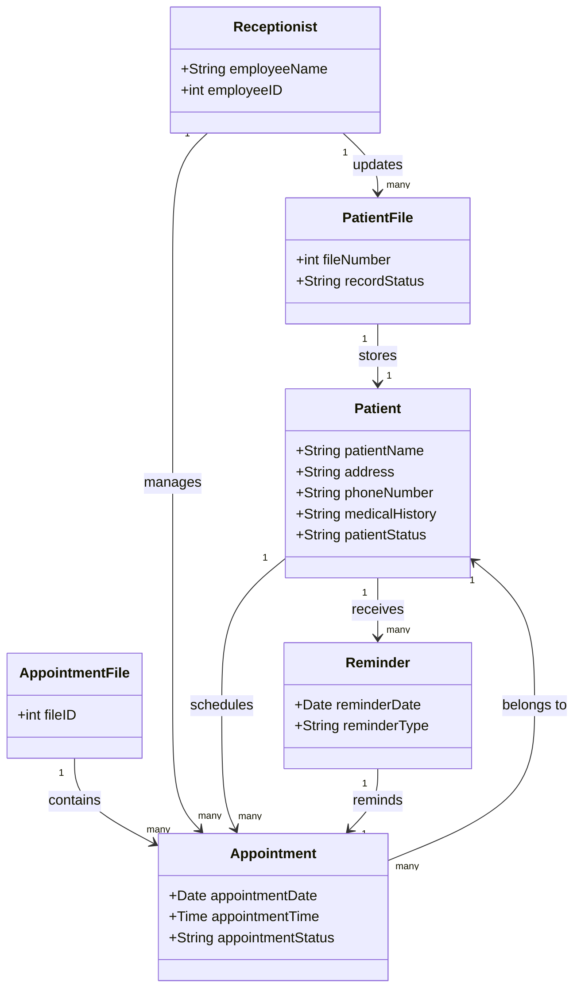

```mermaid
classDiagram

class Patient {
  +String patientName
  +String address
  +String phoneNumber
  +String medicalHistory
  +String patientStatus
}

class Appointment {
  +Date appointmentDate
  +Time appointmentTime
  +String appointmentStatus
}

class Receptionist {
  +String employeeName
  +int employeeID
}

class PatientFile {
  +int fileNumber
  +String recordStatus
}

class AppointmentFile {
  +int fileID
}

class Reminder {
  +Date reminderDate
  +String reminderType
}

Patient "1" --> "many" Appointment : schedules
Appointment "many" --> "1" Patient : belongs to
Receptionist "1" --> "many" Appointment : manages
Receptionist "1" --> "many" PatientFile : updates
PatientFile "1" --> "1" Patient : stores
AppointmentFile "1" --> "many" Appointment : contains
Reminder "1" --> "1" Appointment : reminds
Patient "1" --> "many" Reminder : receives
```