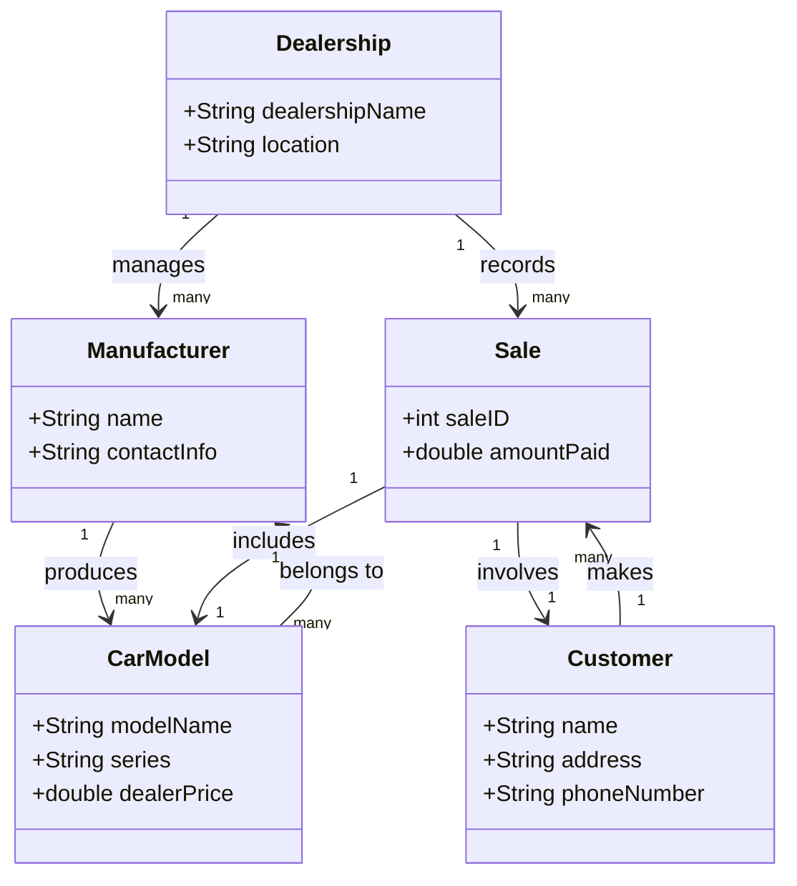

```mermaid
classDiagram

class Dealership {
  +String dealershipName
  +String location
}

class Manufacturer {
  +String name
  +String contactInfo
}

class CarModel {
  +String modelName
  +String series
  +double dealerPrice
}

class Customer {
  +String name
  +String address
  +String phoneNumber
}

class Sale {
  +int saleID
  +double amountPaid
}

Dealership "1" --> "many" Manufacturer : manages
Manufacturer "1" --> "many" CarModel : produces
CarModel "many" --> "1" Manufacturer : belongs to

Dealership "1" --> "many" Sale : records
Sale "1" --> "1" Customer : involves
Sale "1" --> "1" CarModel : includes

Customer "1" --> "many" Sale : makes
```