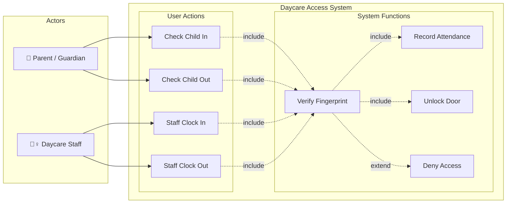

# Daycare Access System - Use Case Diagram

```mermaid
flowchart LR
    subgraph Actors
        Parent["👫 Parent / Guardian"]
        Staff["🧍‍♀️ Daycare Staff"]
    end

    subgraph System["Daycare Access System"]
        subgraph UserActions["User Actions"]
            UC1["Check Child In"]
            UC2["Check Child Out"]
            UC3["Staff Clock In"]
            UC4["Staff Clock Out"]
        end

        subgraph SystemFunctions["System Functions"]
            UC5["Verify Fingerprint"]
            UC6["Record Attendance"]
            UC7["Unlock Door"]
            UC8["Deny Access"]
        end
    end

    Parent --> UC1
    Parent --> UC2
    Staff --> UC3
    Staff --> UC4

    UC1 -.->|include| UC5
    UC2 -.->|include| UC5
    UC3 -.->|include| UC5
    UC4 -.->|include| UC5

    UC5 -.->|include| UC6
    UC5 -.->|include| UC7
    UC5 -.->|extend| UC8
```
