# Oil Refinery Efficiency Tracking System
## High-Level Network Model

### System Overview
An energy company headquartered in **Dallas, Texas** tracks efficiency across **10 oil refineries** in North America using satellite communication and web-based reporting.

---

## Mermaid Network Diagram

```mermaid
flowchart TB
    subgraph HQ["Corporate HQ - Dallas, Texas"]
        MF[("Corporate Mainframe")]
        WS["Web Server"]
        MF <--> WS
    end

    subgraph SAT["Satellite Communication Network"]
        SATNET(("Satellite"))
    end

    subgraph INTERNET["Internet Cloud"]
        ISP(("ISP/Internet"))
    end

    subgraph R1["Valdez, Alaska (Farthest)"]
        PC1["PC"]
        DATA1["Production Data"]
        SAT1["Satellite Uplink"]
        DATA1 --> SAT1
    end

    subgraph R2["Edmonton, Alberta"]
        PC2["PC"]
        SAT2["Satellite Uplink"]
    end

    subgraph R3["Los Angeles, CA"]
        PC3["PC"]
        SAT3["Satellite Uplink"]
    end

    subgraph R4["Salt Lake City, UT"]
        PC4["PC"]
        SAT4["Satellite Uplink"]
    end

    subgraph R5["Denver, CO"]
        PC5["PC"]
        SAT5["Satellite Uplink"]
    end

    subgraph R6["Oklahoma City, OK"]
        PC6["PC"]
        SAT6["Satellite Uplink"]
    end

    subgraph R7["Houston, TX"]
        PC7["PC"]
        SAT7["Satellite Uplink"]
    end

    subgraph R8["Corpus Christi, TX"]
        PC8["PC"]
        SAT8["Satellite Uplink"]
    end

    subgraph R9["New Orleans, LA"]
        PC9["PC"]
        SAT9["Satellite Uplink"]
    end

    subgraph R10["San Antonio, TX (Nearest)"]
        PC10["PC"]
        SAT10["Satellite Uplink"]
    end

    %% Satellite connections (Weekly Upload)
    SAT1 -.->|Weekly Upload| SATNET
    SAT2 -.->|Weekly Upload| SATNET
    SAT3 -.->|Weekly Upload| SATNET
    SAT4 -.->|Weekly Upload| SATNET
    SAT5 -.->|Weekly Upload| SATNET
    SAT6 -.->|Weekly Upload| SATNET
    SAT7 -.->|Weekly Upload| SATNET
    SAT8 -.->|Weekly Upload| SATNET
    SAT9 -.->|Weekly Upload| SATNET
    SAT10 -.->|Weekly Upload| SATNET

    SATNET ==>|Performance Data| MF

    %% Internet connections (Report Access)
    PC1 -->|ISP| ISP
    PC2 -->|ISP| ISP
    PC3 -->|ISP| ISP
    PC4 -->|ISP| ISP
    PC5 -->|ISP| ISP
    PC6 -->|ISP| ISP
    PC7 -->|ISP| ISP
    PC8 -->|ISP| ISP
    PC9 -->|ISP| ISP
    PC10 -->|ISP| ISP

    ISP ==>|Web Reports| WS
```



---

## Network Components

### Corporate Headquarters (Dallas, Texas)
| Component | Description |
|-----------|-------------|
| Corporate Mainframe | Central data storage and processing for all refinery data |
| Web Server | Hosts reports accessible via Internet/Web browser |

### Refinery Sites (10 Locations)
| Location | State/Region | Notes |
|----------|--------------|-------|
| Valdez | Alaska | Farthest from HQ |
| Edmonton | Alberta, Canada | Northern location |
| Los Angeles | California | West Coast |
| Salt Lake City | Utah | Mountain region |
| Denver | Colorado | Mountain region |
| Oklahoma City | Oklahoma | Central US |
| Houston | Texas | Major refining hub |
| Corpus Christi | Texas | Gulf Coast |
| New Orleans | Louisiana | Gulf Coast |
| San Antonio | Texas | Nearest to HQ |

### Each Refinery Site Contains:
- **Production Sensors/Data Collection** - Gathers efficiency metrics
- **Satellite Uplink** - Transmits weekly performance data to Dallas
- **Personal Computer (PC)** - Used by production managers
- **ISP Connection** - Internet access for web-based report viewing

---

## Data Flow

### 1. Weekly Data Upload (Satellite)
```
Refinery Sensors → Satellite Uplink → Satellite Network → Corporate Mainframe
```

### 2. Report Access (Internet/Web)
```
Production Manager PC → ISP → Internet → Web Server → Reports
```

---

## Visio Implementation Guide

When creating this in Visio, use these shapes:

1. **Dallas HQ**: Use "Building" or "Data Center" shape
2. **Mainframe**: Use "Server" or "Mainframe" shape
3. **Web Server**: Use "Web Server" shape
4. **Satellite**: Use "Satellite" or "Cloud" shape
5. **Internet**: Use "Cloud" shape labeled "Internet"
6. **Refinery Sites**: Use "Building" or "Factory" shapes
7. **PCs**: Use "Computer" or "Workstation" shapes
8. **Connections**:
   - Dashed lines for satellite links
   - Solid lines for Internet/ISP connections

### Suggested Layout
- Place Dallas HQ at center-top
- Satellite cloud above or beside HQ
- Internet cloud on opposite side
- Arrange 10 refineries in arc below, with Valdez (Alaska) on far left and San Antonio on far right (nearest)

---

## File References
- `OilRefinery_NetworkModel.puml` - PlantUML source (render at plantuml.com)
- `OilRefinery_NetworkModel.md` - This documentation file
