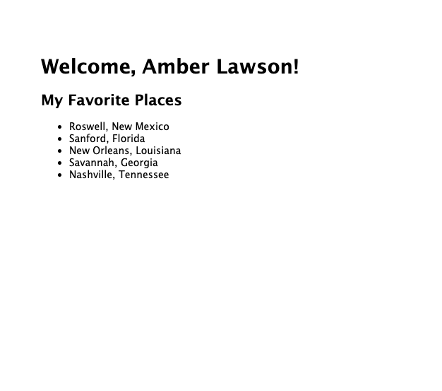
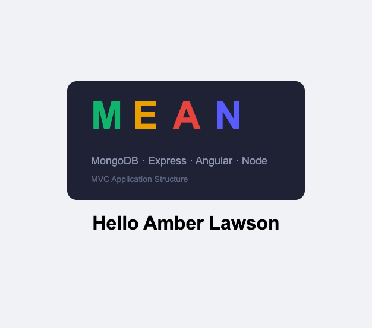
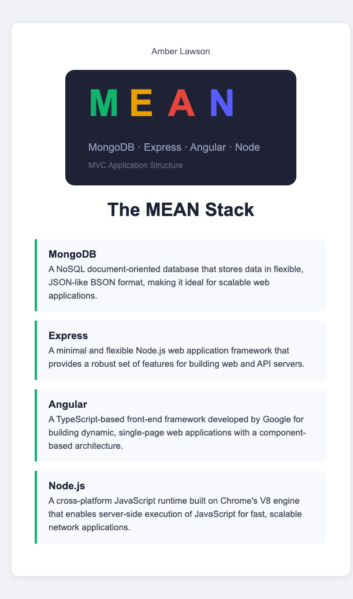

# Week 1: Node.js & Express Fundamentals

This week covers foundational concepts of Node.js and Express, building up to full MEAN stack applications with proper MVC architecture.

## Applications in This Week

### 1. [First Application](./first_application/)
A simple Express.js application with EJS templating demonstrating basic Node.js web server setup.

**Run:** `npm install && npm start` (port 3000)

---

### 2. [Guided Practice: MEAN Stack MVC App](./gp-mvc-mean-app/)
A MEAN (MongoDB, Express, Angular, Node.js) stack application demonstrating Model-View-Controller architecture patterns.

**Run:** `npm install && npm start` (port 3000)

---

### 3. [Practice Assignment: MEAN Stack MVC](./pa-mean-mvc/)
A practice assignment showcasing the MEAN stack with proper MVC separation of concerns and documentation about each technology.

**Run:** `npm install && npm start` (port 3000)

---

## Learning Progression

1. **First Application** → Basic Express setup with EJS templates
2. **GP MVC App** → Introduction to MVC pattern with MEAN stack
3. **PA MVC App** → Reinforcement of MVC concepts with enhanced documentation

Each application includes a detailed `README.md` with setup instructions and preview images showing the running application.
