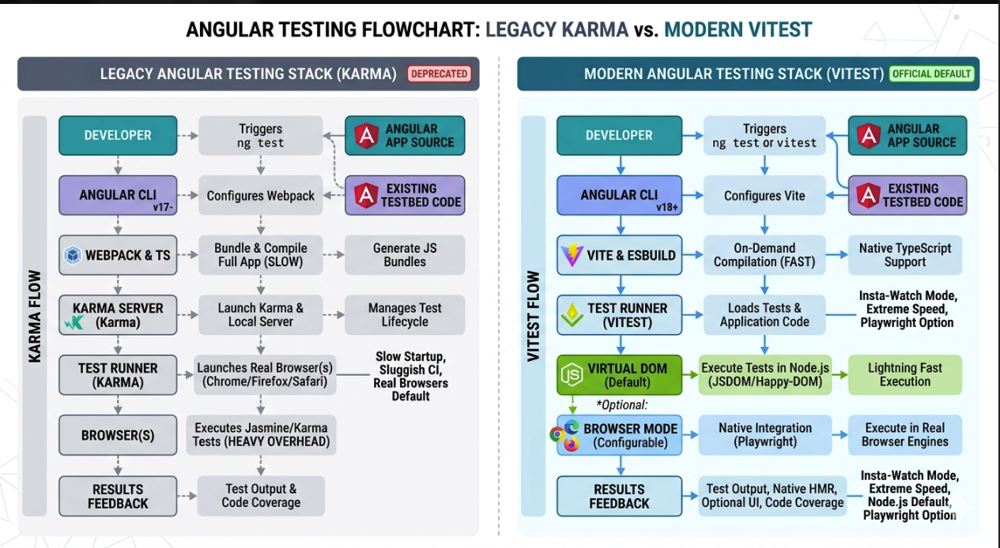
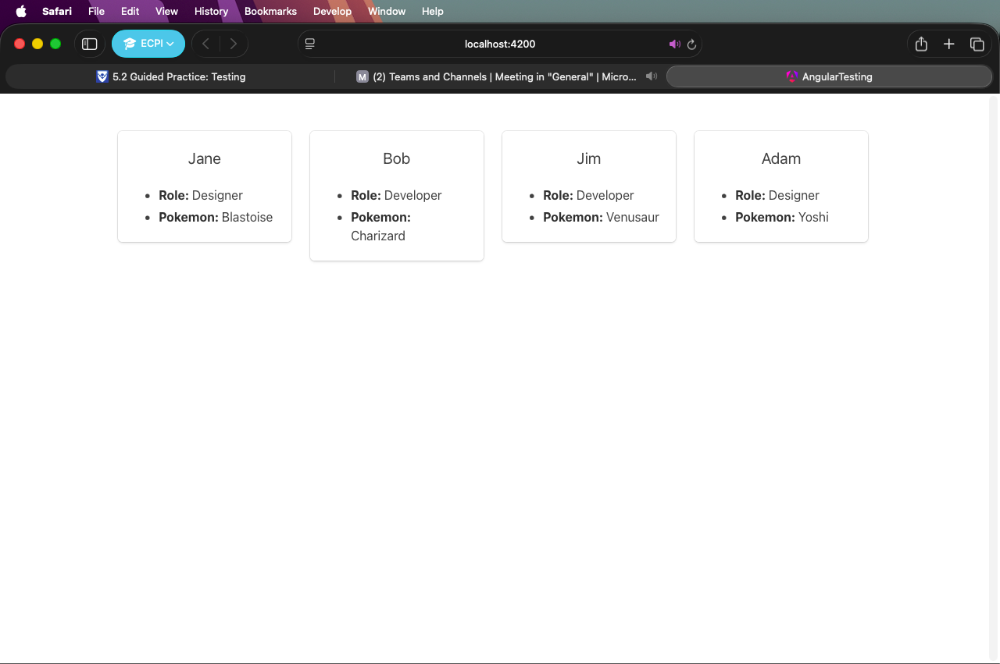

I followed the guided steps and verified the tests pass, but my Angular
project uses a newer default test runner (Vitest) instead of the older
Karma browser runner shown in the instructions. Because of that, running
ng test reports results in the terminal and does not open the Karma
browser window. The assignment requirements were still completed: tests
were created/updated as requested, and all tests pass successfully. I
included screenshots of the successful test run output and the running
application UI as equivalent proof. It got a little confusing, but I had
Nano Banana generate this flowchart.

<https://github.com/LawSwan/schoolProjects/tree/webdev/week5>

